# Contexte de Projet DevOps Datascientest


# Déployer une application Reddit sur Amazon Elastic Kubernetes Service (EKS) avec ArgoCD , surveiller ses performances avec Prometheus et Grafana , Backup et restauration avec Velero


# Introduction

Dans le monde en constante évolution du développement logiciel moderne, la convergence entre développement, sécurité et opérations, connue sous le nom de **DevOps**, est devenue essentielle pour fournir des applications fiables et sécurisées à grande échelle. Alors que les organisations s'efforcent d'accélérer leurs cycles de livraison tout en maintenant des standards élevés de sécurité et de fiabilité, l'adoption de pratiques DevOps Datascientest robustes est primordiale.

Dans ce projet, nous allons nous plonger dans l'univers passionnant du DevOps  en explorant comment déployer une application populaire, **Reddit**, sur **Amazon Elastic Kubernetes Service (EKS)** en utilisant **ArgoCD**, un outil GitOps de livraison continue,  surveiller ses performances pour des résultats optimaux et mettre en place un plan sauvegarde pour faciliter la reprise après sinistre .

Nous examinerons chaque étape de ce processus : de la mise en place de l'infrastructure sur AWS EKS, à l'orchestration du déploiement avec ArgoCD, en passant par la mise en œuvre de solutions de surveillance complètes pour garantir la santé et les performances de notre application Reddit.

Rejoignez-nous dans ce voyage pour démystifier les subtilités du DevOps, en combinant l'agilité des pratiques modernes de développement avec la robustesse de la sécurité et de l'excellence opérationnelle. À la fin de ce parcours, vous aurez acquis des connaissances précieuses pour construire des applications cloud-natives résilientes et sécurisées, et serez prêt à appliquer les principes de DevOps  à vos propres projets avec confiance et succès. Plongeons-y ! 

------

## Pourquoi ArgoCD et AWS EKS ?

**Amazon EKS (Elastic Kubernetes Service)** et **Argo CD** forment une combinaison puissante pour déployer et gérer des applications conteneurisées de manière fiable et efficace dans le cloud AWS. Voici les principales raisons pour lesquelles vous pourriez choisir cette solution :

### Amazon EKS :

- **Kubernetes managé:** EKS vous permet de bénéficier des avantages de Kubernetes sans avoir à gérer l'infrastructure sous-jacente. AWS se charge de la mise à jour, de la sécurité et de la haute disponibilité de votre cluster.
- **Intégration profonde avec AWS:** EKS s'intègre de manière native avec d'autres services AWS comme IAM, VPC, EBS, etc., ce qui facilite la gestion de vos ressources cloud.
- **Communauté et écosystème:** Kubernetes étant une plateforme open source très populaire, vous bénéficiez d'une vaste communauté, de nombreux outils et d'une documentation abondante.

### Argo CD :

- **GitOps:** Argo CD est un outil de déploiement GitOps qui vous permet de gérer l'état désiré de votre application dans un référentiel Git. Cela garantit une traçabilité complète et facilite la collaboration entre les équipes de développement et d'infrastructure.
- **Automatisation:** Argo CD automatise le processus de déploiement et de mise à jour de vos applications, ce qui réduit les erreurs manuelles et accélère la mise en production.
- **Synchronisation continue:** Argo CD surveille en permanence votre référentiel Git et synchronise automatiquement votre cluster Kubernetes avec les modifications apportées.
- **Visualisation et audit:** Argo CD fournit une interface utilisateur intuitive pour visualiser l'état de vos applications, suivre l'historique des déploiements et effectuer des audits.

### Pourquoi combiner EKS et Argo CD ?

En combinant EKS et Argo CD, vous obtenez :

- **Déploiements automatisés et fiables:** Argo CD s'occupe de déployer et de mettre à jour vos applications sur votre cluster EKS de manière automatisée et fiable, en suivant les bonnes pratiques de GitOps.
- **Gestion déclarative:** Vous décrivez l'état désiré de votre application dans un fichier YAML, et Argo CD s'assure que cet état est maintenu dans votre cluster.
- **Collaboration améliorée:** GitOps facilite la collaboration entre les équipes de développement et d'infrastructure, en offrant une source de vérité unique pour l'état de l'application.
- **Meilleure gouvernance:** Argo CD vous permet de mettre en place des contrôles d'accès et des workflows d'approbation pour garantir la sécurité et la conformité de vos déploiements.

**En résumé**, EKS et Argo CD offrent une solution complète pour déployer et gérer des applications conteneurisées dans le cloud AWS de manière efficace, sécurisée et conforme aux meilleures pratiques.

**Cas d'utilisation typiques:**

- **Déploiements continus:** Intégrez Argo CD à votre pipeline CI/CD pour déployer automatiquement les nouvelles versions de votre application.
- **Gestion de plusieurs environnements:** Utilisez des branches Git différentes pour gérer les différents environnements (développement, staging, production).
- **Rollbacks faciles:** En cas de problème, vous pouvez facilement revenir à une version précédente de votre application en modifiant simplement votre référentiel Git.

### 1. **Workflow GitOps**

ArgoCD suit la méthodologie GitOps, où l'état souhaité du cluster Kubernetes est défini de manière déclarative dans des dépôts Git. Cette approche apporte de nombreux avantages, notamment des configurations versionnées, une traçabilité accrue, et la possibilité de revenir facilement à des versions antérieures. En utilisant Git comme source unique de vérité, ArgoCD garantit la cohérence et la fiabilité des déploiements applicatifs.

GitOps est une méthodologie pour gérer l'infrastructure et les applications Kubernetes en utilisant Git comme source de vérité. Voici un aperçu général du workflow GitOps :

**1. Définir l'état désiré:**

- **Déclarer l'infrastructure et les applications:** Utilisez des fichiers YAML pour décrire l'état souhaité de votre infrastructure Kubernetes (déploiements, services, configurations, etc.).
- **Stocker dans Git:** Committez ces fichiers YAML dans un référentiel Git (par exemple, GitHub, GitLab, Bitbucket).

**2. Déploiement automatisé:**

- **Outil de déploiement GitOps:** Utilisez un outil comme Argo CD, Flux, ou Jenkins X pour surveiller le référentiel Git.
- **Synchronisation automatique:** L'outil compare l'état actuel du cluster Kubernetes avec l'état défini dans Git.
- **Appliquer les changements:** Si des différences sont détectées, l'outil applique automatiquement les modifications nécessaires au cluster pour correspondre à l'état désiré.

**3. Gestion des changements:**

- **Pull Requests:** Utilisez des Pull Requests dans Git pour proposer des modifications à l'infrastructure ou aux applications.
- **Revue de code:** Effectuez une revue de code pour valider les modifications avant leur déploiement.
- **Approvals:** Implémentez des workflows d'approbation pour garantir que les changements sont correctement évalués avant d'être appliqués.

**4. Suivi et audit:**

- **Historique des changements:** Git fournit un historique complet des modifications apportées à l'infrastructure et aux applications.
- **Journal des événements:** L'outil de déploiement GitOps enregistre les événements de déploiement, les erreurs et les succès.
- **Visualisation:** Utilisez des tableaux de bord et des outils de visualisation pour suivre l'état de vos déploiements et identifier rapidement les problèmes.

**5. Rollbacks:**

- **Facilement réversibles:** En cas de problème, vous pouvez facilement revenir à une version précédente de votre infrastructure en revenant à un commit précédent dans Git.
- **Automatisation des rollbacks:** Certains outils GitOps permettent d'automatiser les rollbacks en fonction de certaines conditions.

**Avantages de GitOps:**

- **Automatisation:** Réduit les erreurs humaines et accélère les déploiements.
- **Traçabilité:** Fournit un historique complet des changements et facilite le débogage.
- **Collaboration:** Facilite la collaboration entre les équipes de développement et d'infrastructure.
- **Fiabilité:** Améliore la fiabilité et la stabilité des déploiements.
- **Sécurité:** Renforce la sécurité grâce à la gestion des accès et aux contrôles d'approbation.

### 2. **Gestion déclarative des configurations**

EKS fournit un service Kubernetes managé, simplifiant la gestion et le provisionnement des clusters. Avec EKS, vous pouvez vous concentrer sur le déploiement et l'exécution d'applications conteneurisées sans vous soucier de l'infrastructure sous-jacente. ArgoCD complète EKS en fournissant une gestion déclarative des ressources Kubernetes, simplifiant le processus de déploiement et favorisant les pratiques d'infrastructure-as-code.

### 3. **Déploiement continu**

ArgoCD automatise le processus de déploiement, surveille en continu les dépôts Git pour détecter des changements, et synchronise l'état du cluster avec l'état souhaité défini dans le dépôt Git. Cela permet des déploiements rapides et fiables, tout en offrant aux équipes la possibilité de déployer de nouvelles fonctionnalités en toute confiance.

### 4. **Intégration avec Kubernetes**

EKS s'intègre parfaitement avec ArgoCD, offrant une plateforme évolutive et fiable pour exécuter des charges de travail Kubernetes. ArgoCD utilise des ressources natives de Kubernetes, telles que les définitions de ressources personnalisées (CRD) et les contrôleurs, pour gérer les applications et synchroniser leur état avec celui du cluster.

### 5. **Surveillance et observabilité robustes**

ArgoCD et EKS proposent des fonctionnalités de surveillance et d'observabilité avancées. EKS s'intègre à des outils populaires tels que Prometheus et Grafana ou encore Datadog, permettant d'obtenir des insights sur la santé des clusters, les métriques de performance et le comportement des applications. ArgoCD fournit une visibilité sur le processus de déploiement, notamment l'état de synchronisation, la santé des applications et les journaux d'audit, ce qui permet aux équipes de résoudre efficacement les problèmes.

Le choix entre Grafana et Prometheus d'un côté, et Datadog de l'autre, pour mettre en place une solution de surveillance et d'observabilité robuste, dépend en grande partie de vos besoins spécifiques, de votre infrastructure et de vos préférences en matière d'outils.

### Grafana et Prometheus : Une Combinaison Puissante et Flexible

- **Grafana** : C'est une plateforme de visualisation de données open-source qui permet de créer des tableaux de bord riches et interactifs à partir de diverses sources de données. Elle excelle dans la visualisation de métriques, de logs et de traces.
- **Prometheus** : C'est un système de monitoring open-source conçu pour collecter et stocker des métriques en temps réel. Il est particulièrement adapté aux environnements dynamiques et aux applications conteneurisées.

**Avantages de cette combinaison:**

- **Flexibilité:** Grande personnalisation des tableaux de bord et des alertes.
- **Coût:** Solution open-source, donc gratuite.
- **Communauté:** Forte communauté et écosystème d'extensions.
- **Intégration:** S'intègre facilement avec d'autres outils de l'écosystème Kubernetes.

**Inconvénients:**

- **Complexité:** Nécessite une configuration plus manuelle que Datadog.
- **Maintien:** Exige une gestion de l'infrastructure sous-jacente.

### Datadog : Une Solution Tout-en-Un

Datadog est une plateforme d'observabilité cloud native qui offre une solution complète pour la surveillance des applications, des infrastructures et des services. Elle combine des fonctionnalités de monitoring, de logging et de tracing dans une seule interface.

**Avantages de Datadog:**

- **Simplicité:** Interface utilisateur intuitive et configuration simplifiée.
- **Fonctionnalités riches:** Couvre un large éventail de fonctionnalités, y compris la détection d'anomalies, la cartographie des dépendances, et l'intégration avec de nombreux outils.
- **Scalabilité:** Facilement scalable pour gérer des environnements de grande taille.

**Inconvénients:**

- **Coût:** Modèle de tarification basé sur l'utilisation, pouvant devenir coûteux pour les grandes entreprises.
- **Dépendance:** Verrouillage fournisseur potentiel si vous choisissez de migrer vers une autre solution.

### Quand choisir quoi ?

- Choisissez Grafana et Prometheus si:
  - Vous avez besoin d'une solution hautement personnalisable et flexible.
  - Vous souhaitez contrôler entièrement votre infrastructure.
  - Vous avez des contraintes budgétaires.
- Choisissez Datadog si:
  - Vous recherchez une solution tout-en-un facile à mettre en œuvre.
  - Vous avez besoin de fonctionnalités avancées comme la détection d'anomalies et la cartographie des dépendances.
  - Vous êtes prêt à investir dans une solution commerciale.

### Critères de choix

- **Complexité de votre infrastructure:** Une infrastructure complexe peut bénéficier d'une solution comme Datadog pour simplifier la gestion.
- **Budget:** Si le coût est un facteur déterminant, Grafana et Prometheus peuvent être plus adaptés.
- **Besoins en matière de personnalisation:** Si vous avez des besoins spécifiques en matière de visualisation et d'alertes, Grafana offre une grande flexibilité.
- **Équipe:** Les compétences de votre équipe technique peuvent influencer votre choix.

### 6. **Backup et restauration avec Velero**

**Velero** est un outil open-source puissant et flexible conçu pour sauvegarder et restaurer de manière fiable les ressources de votre cluster Kubernetes, y compris les volumes persistants. Il est particulièrement utile pour :

- **La sauvegarde régulière:** Mettre en place des sauvegardes automatiques pour assurer la continuité de service.
- **La restauration en cas de catastrophe:** Récupérer rapidement votre cluster en cas de panne ou de perte de données.
- **La migration:** Déplacer des applications d'un cluster à un autre.

### Comment ça marche ?

Velero fonctionne en créant des snapshots de vos ressources Kubernetes et en les stockant dans un backend de stockage de votre choix (S3, Google Cloud Storage, etc.). Lors d'une restauration, Velero utilise ces snapshots pour recréer les ressources dans un nouveau ou un existant cluster.

### Pourquoi utiliser Velero ?

- **Polyvalence:** Prend en charge une large gamme de backends de stockage et de fournisseurs de cloud.
- **Flexibilité:** Permet de personnaliser les sauvegardes et les restaurations grâce à des politiques et des hooks.
- **Intégration facile:** S'intègre facilement avec d'autres outils de l'écosystème Kubernetes.
- **Communauté active:** Bénéficie d'une communauté importante et d'une documentation riche.

### Fonctionnalités clés

- **Sauvegarde de ressources Kubernetes:** Sauvegarde des pods, services, déploiements, volumes persistants, etc.
- **Sauvegarde de volumes persistants:** Prise en charge de différents types de volumes persistants (NFS, iSCSI, etc.).
- **Restauration sélective:** Possibilité de restaurer des ressources spécifiques ou l'ensemble du cluster.
- **Politique de sauvegarde:** Définition de politiques de sauvegarde personnalisées (fréquence, rétention, etc.).
- **Intégration avec des outils CI/CD:** Automatisation des sauvegardes et des restaurations dans votre pipeline CI/CD.

------

## **Prérequis**

Avant de commencer, assurez-vous d'avoir les éléments suivants :

- Un cluster Kubernetes fonctionnel (EKS, kubeadm, etc.).
- Un compte AWS avec les permissions nécessaires pour créer un bucket S3 et une politique IAM.
- L'outil en ligne de commande `kubectl` configuré.
- L'outil `aws-cli` configuré pour votre compte AWS.
- Un utilisateur ou rôle AWS avec accès au bucket S3.


### **Étape 1 : Configurer le serveur Jenkins**

1. **Cloner le dépôt :**

   ```shell
   git clone https://github.com/DataScientest/Project-GitOps.git](https://github.com/DataScientest/Project-datascientest-eks-argo-GitOps_FR.git
   cd Livrables/Jenkins-Server-TF/
   ```

2. **Modifier le fichier `backend.tf` :**

   - Créez un bucket S3 et une table DynamoDB.

   ```shell
   # Spécifiez le fournisseur AWS
   provider "aws" {
     region = "us-east-1" # Remplacez par votre région préférée
   }
   
   # Créez un bucket S3
   resource "aws_s3_bucket" "example_bucket" {
     bucket        = "example-terraform-bucket-123456" # Remplacez par un nom unique
     acl           = "private"
   
     tags = {
       Name        = "example-s3-bucket"
       Environment = "Dev"
     }
   }
   
   # Créez une table DynamoDB
   resource "aws_dynamodb_table" "example_table" {
     name         = "example-terraform-table"
     billing_mode = "PAY_PER_REQUEST"
   
     attribute {
       name = "id"
       type = "S" # 'S' pour String, 'N' pour Number, etc.
     }
   
     hash_key = "id"
   
     tags = {
       Name        = "example-dynamodb-table"
       Environment = "Dev"
     }
   }
   ```

   

3. **Installer Terraform et AWS CLI :**

   ```shell
   # Installer Terraform
   sudo apt install wget -y
   wget -O- https://apt.releases.hashicorp.com/gpg | sudo gpg --dearmor -o /usr/share/keyrings/hashicorp-archive-keyring.gpg
   echo "deb [signed-by=/usr/share/keyrings/hashicorp-archive-keyring.gpg] https://apt.releases.hashicorp.com $(lsb_release -cs) main" | sudo tee /etc/apt/sources.list.d/hashicorp.list
   sudo apt update && sudo apt install terraform
   
   # Installer AWS CLI
   curl "https://awscli.amazonaws.com/awscli-exe-linux-x86_64.zip" -o "awscliv2.zip"
   sudo apt-get install unzip -y
   unzip awscliv2.zip
   sudo ./aws/install
   
   # Configurer AWS CLI
   aws configure
   ```

   Fournissez votre AWS Access Key ID, Secret Access Key, nom de région, et format de sortie.

4. **Exécuter les commandes Terraform :**

   ```shell
   terraform init
   terraform validate
   terraform plan -var-file=variables.tfvars
   terraform apply -var-file=variables.tfvars --auto-approve
   ```

   - Cela créera une instance sur AWS.

5. **Accéder à Jenkins :**

   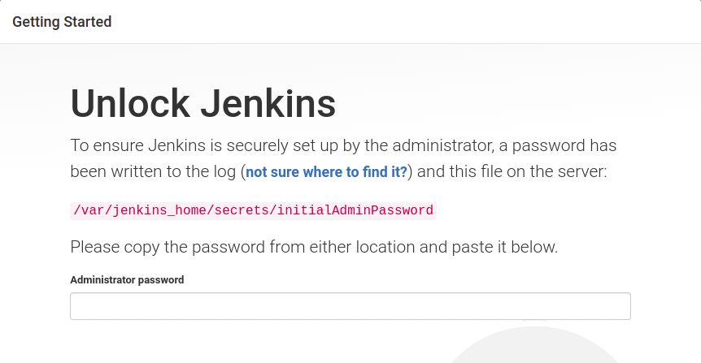

   - Copiez l'adresse IP publique de l'instance et accédez à Jenkins via votre navigateur préféré :

     ```
      <adresse_ip_publique>:8080
     ```

6. **Obtenir le mot de passe Jenkins :**

              ```shell
              cat /var/jenkins_home/secrets/initialadminpassword
              ```

   - Connectez-vous à l'instance , récupérez le mot de passe , et installez les plugins recommandés .

7. **Créer un utilisateur Jenkins :**

   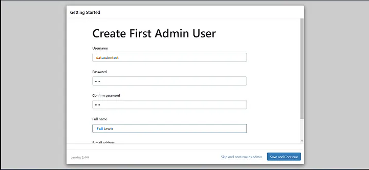

   - (Facultatif) Créez un utilisateur si vous ne souhaitez pas conserver le mot de passe par défaut.

8. **Installer les plugins nécessaires :**

   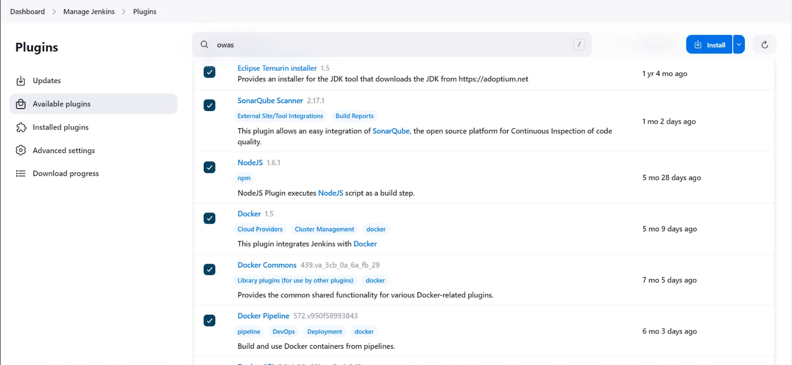

   - Allez dans 

     Gérer Jenkins → Plugins → Plugins disponibles

      et installez les plugins suivants sans redémarrer :

     1. Eclipse Temurin Installer
     2. SonarQube Scanner
     3. NodeJs Plugin
     4. Plugins Docker (Docker, Docker commons, Docker pipeline, Docker API, Docker Build step)
     5. OWASP Dependency Check
     6. Terraform
     7. AWS Credentials
     8. Pipeline: AWS Steps
     9. Prometheus Metrics Plugin

9. **Accéder à la console SonarQube créé via le script d'installation d'Outils sur l'instance EC2 :**

   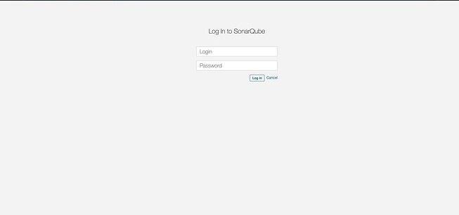

   ```
   <adresse_ip_publique>:9000
   ```

   - Le nom d'utilisateur et le mot de passe par défaut sont "admin". Modifiez le mot de passe et configurez selon vos besoins.

     

     1. Connectez-vous à l'interface web de votre SonarQube.

     2. Cliquez sur votre **avatar utilisateur** dans le coin supérieur droit, puis sur **My Account**.

     3. Accédez à l'onglet **Tokens**.

     4. Cliquez sur 

        `Generate Token`:

        - Donnez un nom au token, par exemple `jenkins-token`.
        - Cliquez sur **Generate**.

     5. Copiez le token généré. **Ce token ne sera affiché qu'une seule fois, alors enregistrez-le dans un endroit sûr.**

     1. Connectez-vous à Jenkins.

     2. Allez dans **Manage Jenkins** > **Configure System**.

     3. Faites défiler jusqu'à la section **SonarQube Servers**.

     4. Cliquez sur 

        Add SonarQube

         et configurez les champs suivants :

        - **Name** : Donnez un nom descriptif (par exemple, `SonarQube`).
        - **Server URL** : Entrez l'URL du serveur SonarQube (par exemple, `http://localhost:9000` ou `http://sonarqube.datascientest.com`).
        - Authentication Token:
          - Cliquez sur **Add** > **Jenkins**.
          - Entrez un ID descriptif (par exemple, `sonarqube-token`) et collez le token copié de SonarQube.

     5. Cliquez sur **Save** pour enregistrer.

     ------

     1. Accédez à **Manage Jenkins** > **Global Tool Configuration**.

     2. Faites défiler jusqu'à la section **SonarQube Scanner**.

     3. Cliquez sur 

        Add SonarQube Scanner

         :

        - Donnez un nom (par exemple, `SonarQubeScanner`).
        - Cochez **Install automatically** pour installer automatiquement le scanner.

     4. Cliquez sur **Save**.

10. **Créer et configurer les identifiants :**

    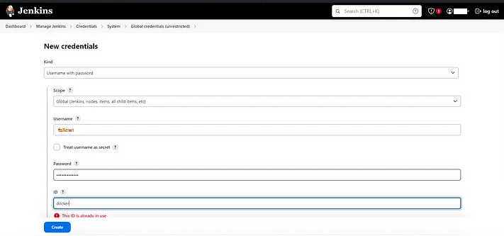

    - Allez dans **Gérer Jenkins → Credentials → Global** et créez des identifiants pour AWS, GitHub, et Docker.

------

### **Étape 2 : Créer un cluster EKS avec le Pipeline Jenkins **

1. **Créer un nouveau pipeline Jenkins :**

   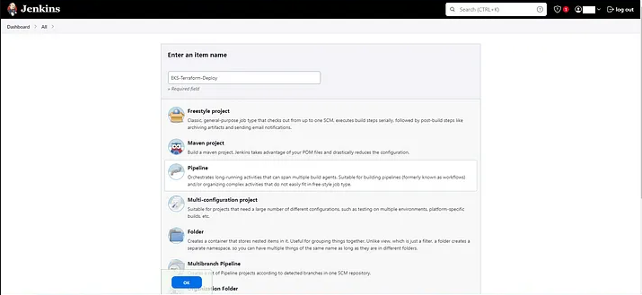

   - Cliquez sur **Nouvel élément**, donnez un nom, sélectionnez **Pipeline**, et cliquez sur **OK**. Vous utiliserez le contenu du fichier `Jenkins-Pipeline-Code/Jenkinsfile-EKS-Terraform`pour la création du Cluster EKS via le pipeline Jenkins.

2. **Configurer le pipeline :**

   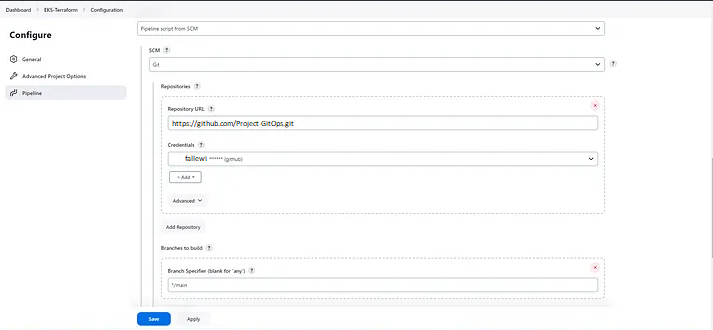

   - Dans la section Pipeline, fournissez l'URL GitHub de votre projet, précisez les identifiants, et le chemin vers le fichier Jenkinsfile.

3. **Exécuter le pipeline :**

   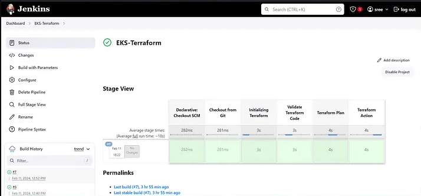

   - Cliquez sur **Appliquer**, puis sur **Construire maintenant**. Cela créera un cluster EKS.

------

### **Étape 3 : Créer un job Jenkins pour construire et pousser l'image**

1. **Créer un nouveau job Jenkins :**

   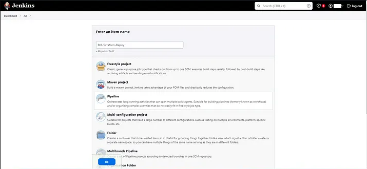

   - Cliquez sur **Nouvel élément**, donnez un nom, sélectionnez **Pipeline**, et cliquez sur **OK**.

   - Si  vous utilisez Github Actions à la place de Jenkins , vous pouvez utiliser le workfow suivant pour la pipeline :

     ```shell
     name: fall-project create AWS and EKS infra with Terraform
     
     on:
       push:
         branches: [ "main" ]
         tags: [ 'v*.*.*' ]
       pull_request:
         branches: [ "aws" ]
     
     env:
       AWS_REGION: ${{ vars.AWS_REGION }}
       IAM_ROLE: ${{ secrets.IAM_ROLE}}
       TF_CLOUD_ORGANIZATION: "Cashnow"
       TF_API_TOKEN: "${{ secrets.TF_API_TOKEN }}"
       TF_WORKSPACE: ${{ vars.TF_WORKSPACE }}
     
     permissions:
           id-token: write   # This is required for requesting the JWT
           contents: read    # This is required for actions/checkout
     
     jobs:
       terraform:
         runs-on: ubuntu-latest
         steps:
           - name: Checkout
             uses: actions/checkout@v3
     
           - name: Configure AWS credentials
             uses: aws-actions/configure-aws-credentials@v4
             with:
               role-to-assume: ${{ env.IAM_ROLE }}
               role-session-name: GitHub_to_AWS_via_FederatedOIDC
               aws-region: ${{ env.AWS_REGION }}
               audience: sts.amazonaws.com.
     
           - name: Upload Configuration
             uses: hashicorp/tfc-workflows-github/actions/upload-configuration@v1.0.0
             id: plan-upload
             with:
               workspace: ${{ env.TF_WORKSPACE }}
               directory: ./
               speculative: true
     
           - name: Create Plan Run
             uses: hashicorp/tfc-workflows-github/actions/create-run@v1.0.0
             id: plan-run
             with:
               workspace: ${{ env.TF_WORKSPACE }}
               configuration_version: ${{ steps.plan-upload.outputs.configuration_version_id }}
               plan_only: true
     
           - name: Get Plan Output
             uses: hashicorp/tfc-workflows-github/actions/plan-output@v1.0.0
             id: plan-output
             with:
               plan: ${{ fromJSON(steps.plan-run.outputs.payload).data.relationships.plan.data.id }}
     
           - name: Upload Configuration
             uses: hashicorp/tfc-workflows-github/actions/upload-configuration@v1.0.0
             id: apply-upload
             with:
               workspace: ${{ env.TF_WORKSPACE }}
               directory: ${{ env.CONFIG_DIRECTORY }}
     
           - name: Create Apply Run
             uses: hashicorp/tfc-workflows-github/actions/create-run@v1.0.0
             id: apply-run
             with:
               workspace: ${{ env.TF_WORKSPACE }}
               configuration_version: ${{ steps.apply-upload.outputs.configuration_version_id }}
     
           - name: Apply
             uses: hashicorp/tfc-workflows-github/actions/apply-run@v1.0.0
             if: fromJSON(steps.apply-run.outputs.payload).data.attributes.actions.IsConfirmable
             id: apply
             with:
               run: ${{ steps.apply-run.outputs.run_id }}
               comment: "Apply Run from GitHub Actions CI ${{ github.sha }}"
     
     ```

     

2. **Créer un nouveau pipeline pour configurer le job de ci/cd de l'application. Le contenu du fichier** `Jenkins-Pipeline-Code/Jenkinsfile-Reddit` **sera utilisé** :

   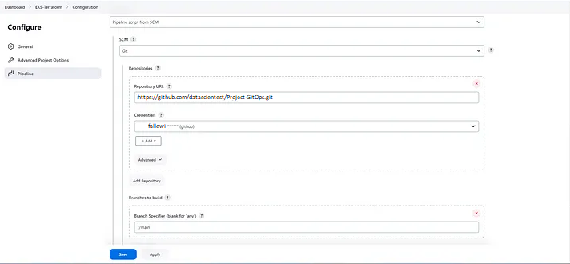

   - Dans la section Pipeline :
     - Choisissez **Script depuis SCM**.
     - Configurez **Git** avec vos identifiants GitHub.
     - Définissez la branche `main` et le chemin du pipeline comme `Jenkins-Pipeline-Code/Jenkinsfile-Reddit`.


### **Étape 3 : Construire le pipeline**

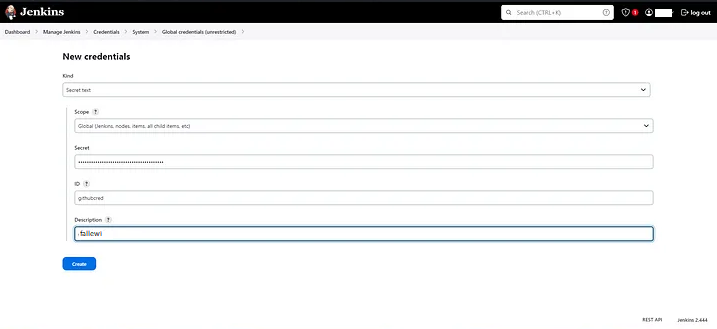

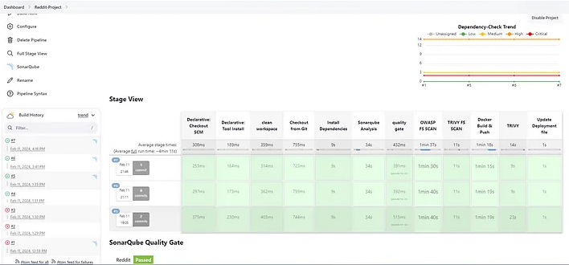

1. **Créer un token GitHub :**
   - Avant de lancer la construction, créez un token GitHub en tant que texte secret avec l'ID `githubcred`. Ce token sera utilisé pour mettre à jour l'image créée dans le fichier `deployment.yml`.
2. **Vérifier les résultats des analyses :**

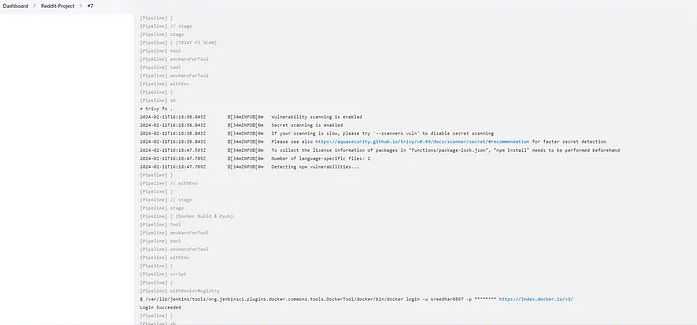

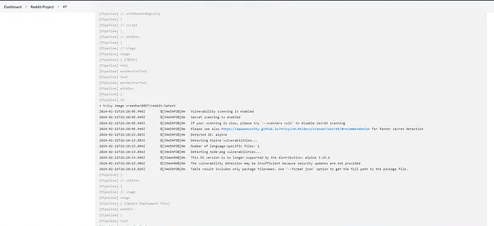

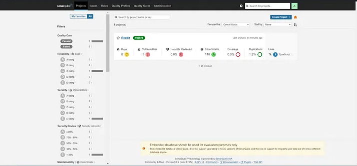

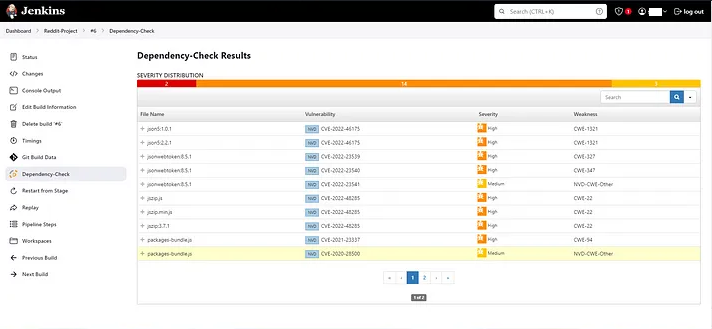

- Affichez les résultats des analyses de sécurité Trivy, les rapports d'analyse SonarQube et les sorties de l'outil Dependency Checker.

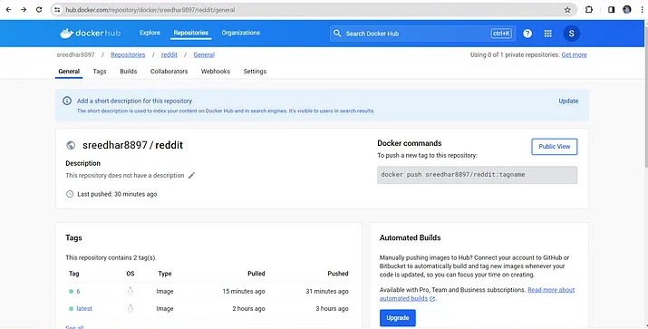

1. Mettre à jour le fichier de déploiement :
   - Le fichier de déploiement sera mis à jour automatiquement avec le tag correspondant au numéro de build Jenkins.

------

### **Étape 4 : Configurer EKS et ArgoCD**

1. **Mettre à jour la configuration du cluster EKS :**

   ```
   aws eks update-kubeconfig --name Reddit-EKS-Cluster
   ```

2. **Installer ArgoCD** :

   ## Installation d'Argo CD sur EKS avec Helm

   **Helm** est un excellent gestionnaire de packages pour Kubernetes qui simplifie grandement l'installation d'applications comme Argo CD. Voici une procédure étape par étape pour installer Argo CD sur votre cluster EKS à l'aide de Helm :

   ### Prérequis

   - **Un cluster EKS fonctionnel:** Assurez-vous que votre cluster EKS est configuré et que vous avez les outils nécessaires (kubectl, AWS CLI) pour interagir avec celui-ci.
   - **Helm installé:** Helm doit être installé sur votre machine locale et configuré pour communiquer avec votre cluster EKS.

   ### Procédure d'installation

   1. Ajouter le repository Argo CD:

      Bash

      ```
      helm repo add argocd https://argoproj.github.io/argo-cd
      ```

   2. Mettre à jour le cache de repository:

      Bash

      ```
      helm repo update
      ```

   3. Installer Argo CD:

      Bash

      ```shell
      helm install argocd argocd/argo-cd
      ```

      Cette commande installera Argo CD dans l'espace de noms 

      ```shell
      argocd
      ```

       avec les valeurs par défaut.

   ### Personnalisation de l'installation

   Pour personnaliser l'installation, vous pouvez utiliser un fichier `values.yaml`. Par exemple, pour spécifier un ingress spécifique :

   YAML

   ```shell
   # values.yaml
   ingress:
     hosts:
       - argocd.datascientest.com
   ```

   Puis, lors de l'installation :

   ```shell
   helm install argocd argocd/argo-cd -f values.yaml
   ```

   ### Exposer l'interface utilisateur

   Après l'installation, vous devrez exposer l'interface utilisateur d'Argo CD. Cela se fait généralement en créant un Ingress. Vous pouvez trouver plus d'informations sur la configuration de l'Ingress dans la documentation d'Argo CD et de votre fournisseur de cloud.

   ### Vérification de l'installation

   Pour vérifier si Argo CD est installé correctement, vous pouvez utiliser les commandes suivantes :

   Bash

   ```shell
   kubectl get pods -n argocd
   kubectl get services -n argocd
   ```

   ### Accès à l'interface utilisateur

   Une fois l'Ingress configuré, vous pourrez accéder à l'interface utilisateur d'Argo CD en utilisant l'URL de votre Ingress.

   ### Points clés à retenir

   - **Personnalisation:** Le fichier `values.yaml` offre de nombreuses options de personnalisation pour adapter l'installation à vos besoins.
   - **Sécurité:** Assurez-vous de configurer correctement les autorisations et les secrets pour protéger votre installation Argo CD.
   - **Intégration CI/CD:** Intégrez Argo CD à votre pipeline CI/CD pour automatiser les déploiements.

   **Documentation officielle:**

   Pour plus d'informations et des options de configuration avancées, consultez la documentation officielle d'Argo CD : https://argo-cd.readthedocs.io/en/stable/

3. **Obtenir les informations d'accès au serveur ArgoCD :**

   ```shell
    export ARGOCD_SERVER=`kubectl get svc argocd-server -n argocd -o json | jq --raw-output '.status.loadBalancer.ingress[0].hostname'`
    
   export ARGO_PWD=`kubectl -n argocd get secret argocd-initial-admin-secret -o jsonpath="{.data.password}" | base64 -d`
   
   echo $ARGO_PWD
   ```

4. **Accéder à la console ArgoCD :**

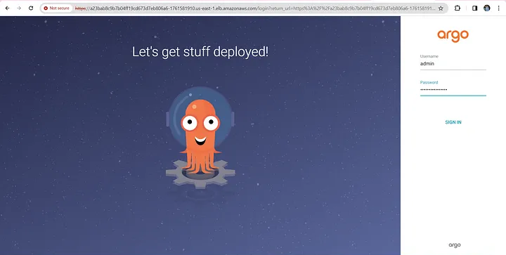

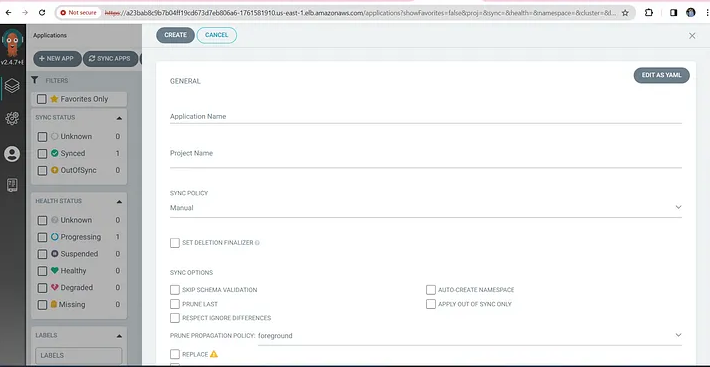

- Connectez-vous en utilisant le DNS et les identifiants.

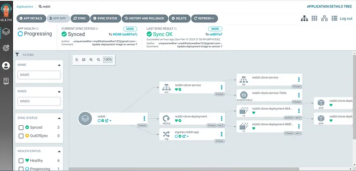

1. **Créer une application ArgoCD :**

   - Dans la console, cliquez sur **Create App**, éditez le YAML et remplacez `repoURL` par l'URL de votre projet GitHub :

   ```shell
   project: default
   source:
     repoURL: 'https://github.com/DataScientest/Project-GitOps.git'
     path: K8s/
     targetRevision: HEAD
   destination:
     server: 'https://kubernetes.default.svc'
     namespace: default
   syncPolicy:
     automated:
       prune: true
       selfHeal: true
   ```

2. **Déployer et synchroniser l'application :**

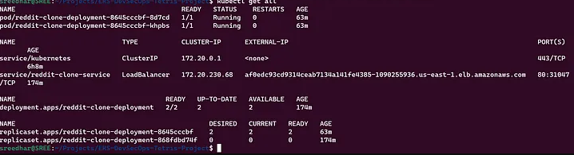


- Cliquez sur **Sync** dans la console pour déployer et synchroniser votre application Reddit avec le cluster EKS.

------

### Etape 5 :**Monitoring avec Prometheus et Grafana**

1. **Déployer Prometheus et Grafana :**

   ```shell
   kubectl create namespace monitoring
   helm repo add prometheus-community https://prometheus-community.github.io/helm-charts
   helm repo update
   helm install prometheus-operator prometheus-community/kube-prometheus-stack -n monitoring
   ```

2. **Exposer les services Prometheus et Grafana :**

   ```
   kubectl expose pod <prometheus-pod> --port=8080 --target-port=9090 --name=prometheus-lb --type=LoadBalancer
   kubectl expose pod <grafana-pod> --port=8081 --target-port=3000 --name=grafana-lb --type=LoadBalancer
   ```

3. **Accéder à Grafana :**

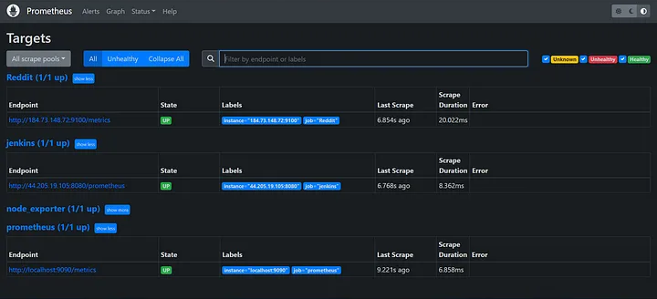

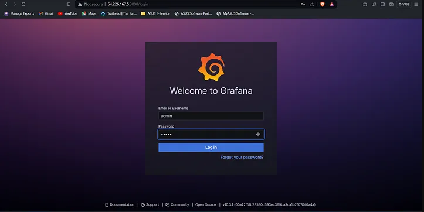

- Copiez l'IP publique exposée et accédez-y via `<ip_publique>:8081`.

1. **Se connecter à Grafana :**

- Identifiants par défaut : `admin/admin`.

1. Configurer la source de données Prometheus dans Grafana :
   - Naviguez vers **Add Data Source → Prometheus**, configurez la source, et commencez à surveiller les métriques.

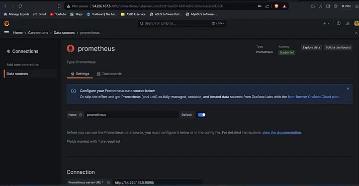

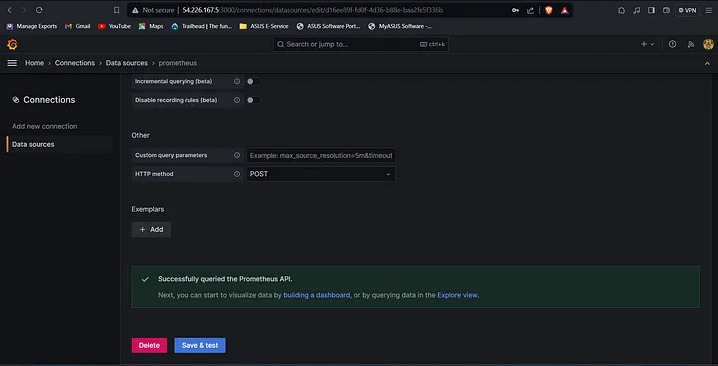


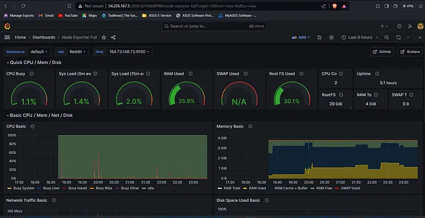

- 

------

### **Analyse et interprétation des métriques**

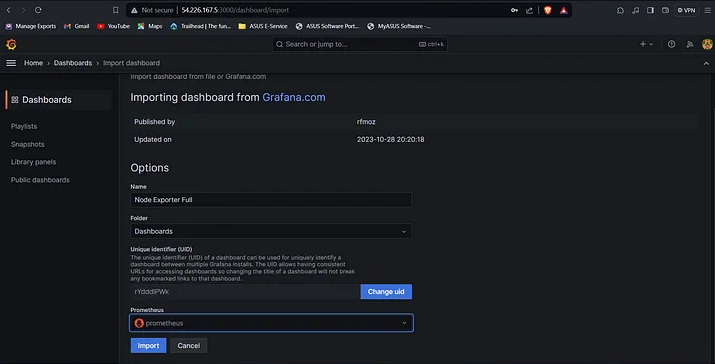

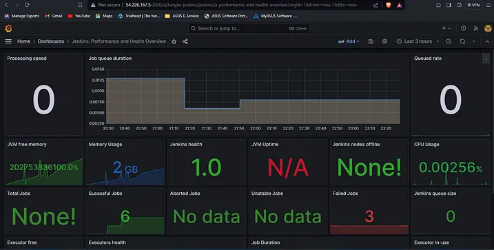

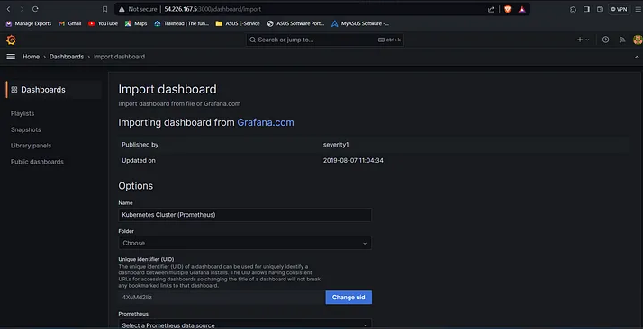

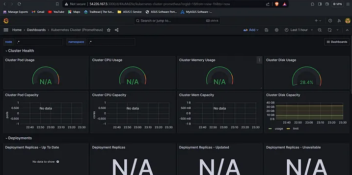

- Une fois la surveillance configurée, vous aurez accès à des tableaux de bord Grafana affichant des métriques détaillées à partir de Prometheus.
- Ces métriques permettent d'identifier les goulets d'étranglement, de surveiller le comportement de l'application sous charge, et de garantir des performances optimales.

## **Étape 6 : Sauvegarde d'un cluster Kubernetes avec Velero et AWS S3**

**1 - Télécharger Velero**

Commencez par télécharger Velero sur votre machine locale.

```shell
curl -L https://github.com/vmware-tanzu/velero/releases/latest/download/velero-linux-amd64.tar.gz -o velero.tar.gz
tar -xvf velero.tar.gz
sudo mv velero /usr/local/bin/
```

**2 -  Vérifier l'installation**

Vérifiez que Velero est correctement installé.

```shell
velero version
```

**3 - Créer un bucket S3**

Connectez-vous à AWS via `aws-cli` et créez un bucket S3.

```shell
aws s3api create-bucket --bucket velero-backup-bucket --region us-east-1
```

Remplacez `velero-backup-bucket` par un nom unique pour votre bucket.

**4 - Configurer une politique IAM pour Velero**

Créez une politique IAM qui donne à Velero l'accès au bucket S3. Enregistrez la politique suivante dans un fichier `velero-policy.json` :

```shell
{
  "Version": "2012-10-17",
  "Statement": [
    {
      "Effect": "Allow",
      "Action": [
        "s3:GetObject",
        "s3:ListBucket",
        "s3:PutObject"
      ],
      "Resource": [
        "arn:aws:s3:::velero-backup-bucket/*",
        "arn:aws:s3:::velero-backup-bucket"
      ]
    }
  ]
}
```

Appliquez cette politique à un utilisateur ou rôle IAM :

```shell
aws iam create-policy --policy-name VeleroPolicy --policy-document file://velero-policy.json
```

**5 - Attacher la politique à un utilisateur ou rôle IAM**

Si vous utilisez un rôle IAM (par exemple pour un nœud EKS), attachez la politique avec :

```shell
aws iam attach-role-policy --role-name <ROLE_NAME> --policy-arn arn:aws:iam::<ACCOUNT_ID>:policy/VeleroPolicy
```

**6 - Installer Velero avec AWS comme fournisseur**

Utilisez la commande suivante pour déployer Velero sur votre cluster Kubernetes :

```shell
velero install \
    --provider aws \
    --plugins velero/velero-plugin-for-aws:v1.6.0 \
    --bucket velero-backup-bucket \
    --backup-location-config region=us-east-1 \
    --snapshot-location-config region=us-east-1 \
    --secret-file ./credentials-velero
```

- **`--provider`** : Définit AWS comme fournisseur cloud.
- **`--plugins`** : Ajoute le plugin AWS pour Velero.
- **`--bucket`** : Indique le nom du bucket S3 créé précédemment.
- **`--backup-location-config`** : Spécifie la région AWS du bucket.
- **`--secret-file`** : Fichier contenant les identifiants AWS.

**7 - Créer un fichier de secrets pour AWS**

Créez un fichier `credentials-velero` contenant vos identifiants AWS :

```shell
[default]
aws_access_key_id = <VOTRE_ACCESS_KEY>
aws_secret_access_key = <VOTRE_SECRET_KEY>
```

Placez ce fichier dans le répertoire courant.

**8 - Vérifier le déploiement de Velero**

Une fois installé, vérifiez que Velero fonctionne correctement.

```shell
kubectl get pods -n velero
```

**9 - Sauvegarder le cluster Kubernetes**

Lancez une sauvegarde complète du cluster Kubernetes, y compris les données de l’**etcd**.

```shell
velero backup create etcd-backup --include-resources configmaps,secrets,pods,namespaces,persistentvolumes
```

**10 - Vérifier l'état de la sauvegarde**

Suivez l'état de la sauvegarde avec la commande suivante :

```shell
velero backup describe etcd-backup --details
```

**11 - Lister les sauvegardes**

Affichez toutes les sauvegardes disponibles :

```shell
velero backup get
```

**12 - Restaurer un cluster depuis une sauvegarde**

Pour restaurer un cluster à partir d'une sauvegarde existante, utilisez la commande suivante :

```shell
velero restore create --from-backup etcd-backup
```

**13 - Vérifier l'état de la restauration**

Suivez l'état de la restauration :

```shell
velero restore describe <RESTORE_NAME> --details
```

**14 - Automatiser les sauvegardes avec Velero**

Pour planifier des sauvegardes automatiques, utilisez les fonctionnalités de Velero :

```shell
velero schedule create daily-backup --schedule="0 2 * * *" --include-resources configmaps,secrets,pods,namespaces,persistentvolumes
```

Cette commande planifie une sauvegarde quotidienne à 2 heures du matin.

------

## **Conclusion**

En combinant Jenkins, ArgoCD, AWS EKS, Prometheus et Grafana, vous construisez une pipeline robuste qui automatise le déploiement, les analyses de sécurité et la surveillance de vos applications. Cette solution embrasse les pratiques DevOps, permettant à vos équipes de se concentrer sur la valeur métier tout en assurant sécurité et fiabilité .**Velero** avec un bucket **S3**, permettrons la mise en place d'une solution robuste pour sauvegarder et restaurer les données critiques d'un cluster Kubernetes. Cette configuration garantit que même en cas de panne ou de suppression accidentelle, vous pouvez récupérer vos données et votre infrastructure rapidement
